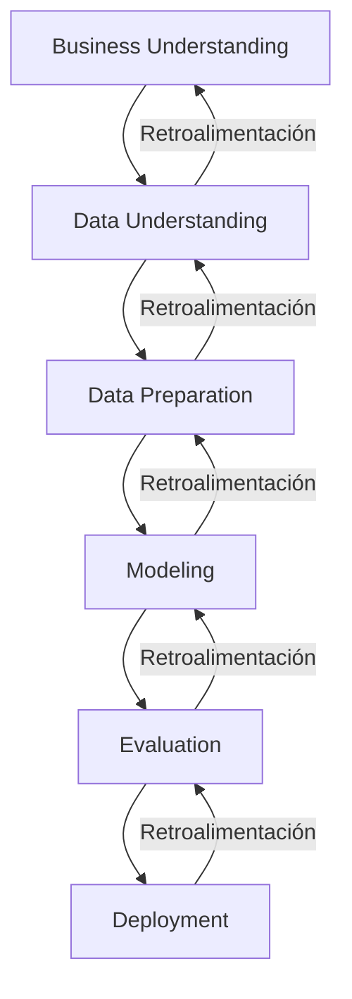
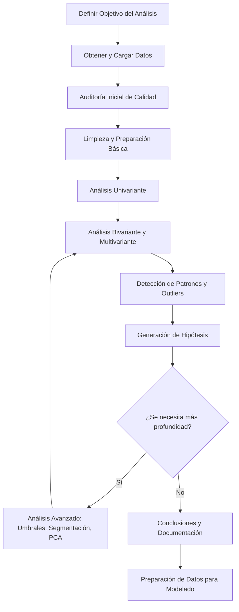
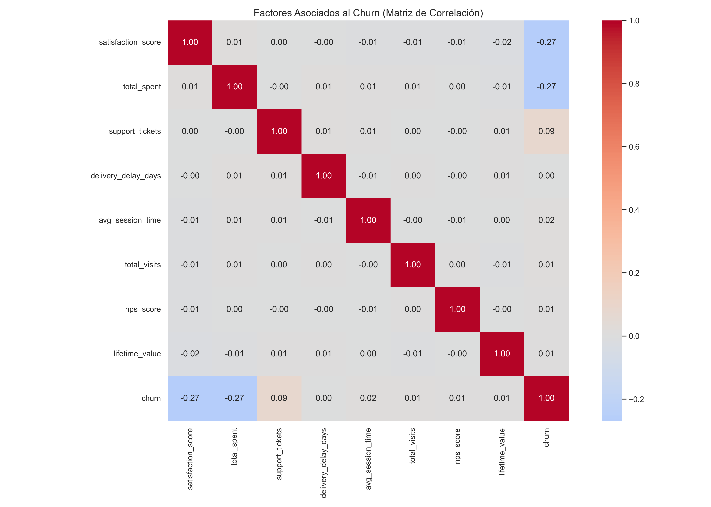
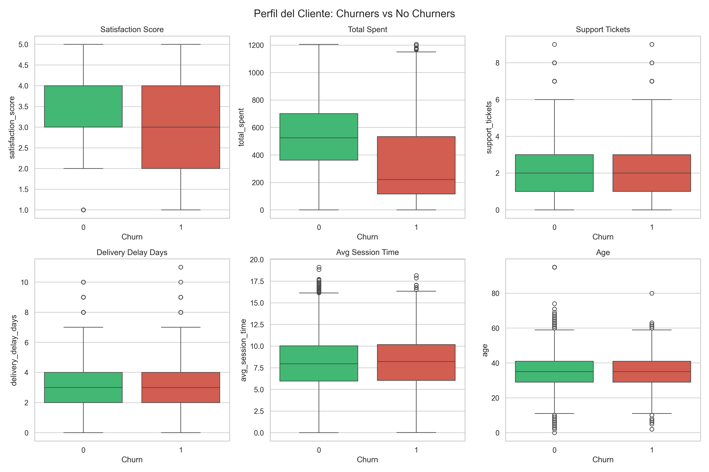
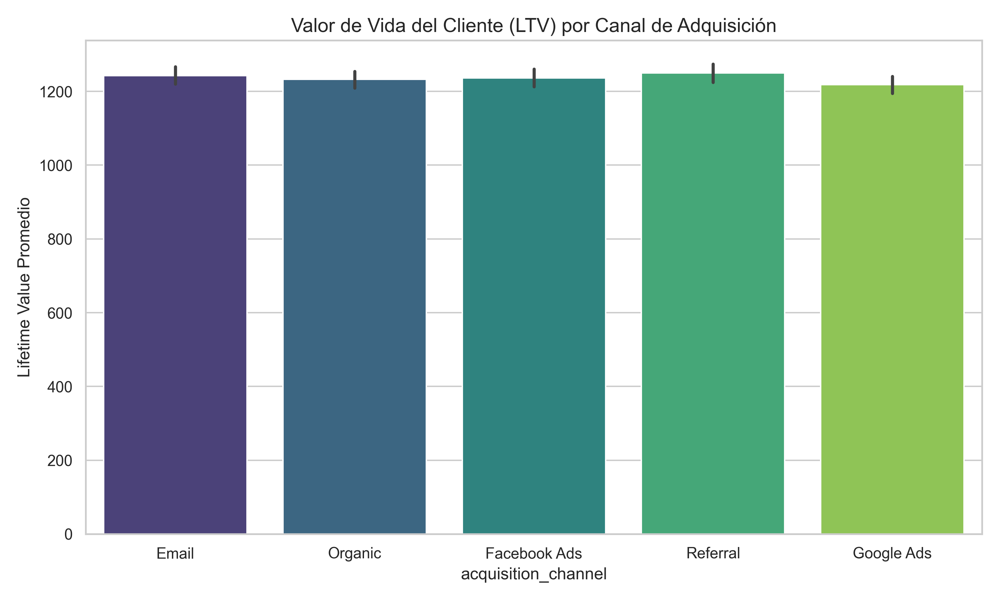
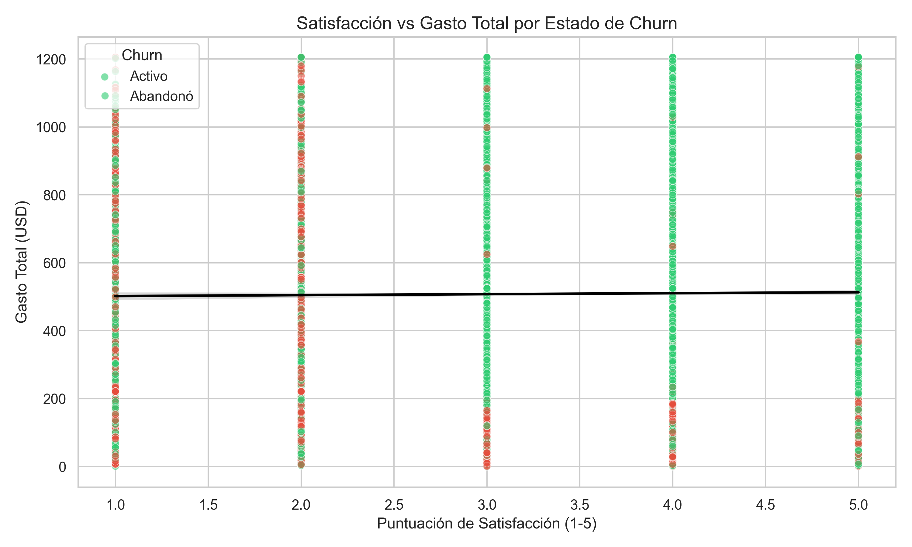
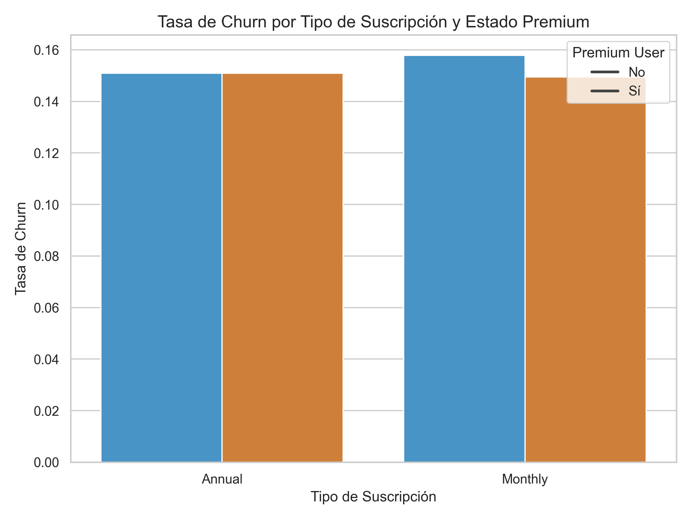

# Sales & Marketing Churn Analysis

<!-- Badges -->
[](https://www.python.org/)
[](https://pandas.pydata.org/)
[](https://scikit-learn.org/)
[](https://xgboost.readthedocs.io/)
[](https://opensource.org/licenses/MIT)
[](https://www.kaggle.com/datasets/bhaskerpaul/sales-and-marketing-dataset)
[](https://jupyter.org/)

---

**Un proyecto de ciencia de datos para predecir el abandono de clientes (churn) utilizando técnicas avanzadas de EDA, ingeniería de características y modelado predictivo.**

Este repositorio forma parte de mi portafolio para la **Maestría en Estadística Aplicada y Ciencia de Datos**. Demuestra habilidades en limpieza de datos, análisis exploratorio, preparación de datos y preparación para modelado.

---

## 📖 Tabla de Contenidos

- [🎯 Problema de Negocio](#-problema-de-negocio)
- [❓ Preguntas Clave de Negocio](#-preguntas-clave-de-negocio)
- [📊 Dataset](#-dataset)
- [📋 Metodología](#-metodología)
- [📈 Antes vs. Después (Calidad de Datos)](#-antes-vs-después-calidad-de-datos)
- [🔍 Data Understanding – Hallazgos Clave](#-data-understanding--hallazgos-clave)
- [📊 Insights de Negocio](#-insights-de-negocio)
- [📊 Visualizaciones Clave](#-visualizaciones-clave)
- [⚙️ Preparación de Datos](#️-preparación-de-datos)
- [🚀 Estado Actual del Proyecto](#-estado-actual-del-proyecto)
- [🔮 Próximos Pasos](#-próximos-pasos-modelado-predictivo)
- [🛠️ Tecnologías y Requisitos](#️-tecnologías-y-requisitos)  
- [🛠️ Instalación y Uso](#️-instalación-y-uso)
- [🤝 Cómo Contribuir](#-cómo-contribuir)
- [📁 Estructura del Proyecto](#-estructura-del-proyecto)
- [📄 Licencia](#-licencia)
- [🙌 Autor y Agradecimientos](#-autor-y-agradecimientos)

---

## 🎯 Problema de Negocio

La empresa enfrenta una tasa de **churn (abandono de clientes) del 15%**, lo que representa una pérdida significativa de ingresos recurrentes. El objetivo es **identificar los factores clave que impulsan el churn** y **predecir qué clientes tienen mayor probabilidad de abandonar**, para diseñar estrategias de retención efectivas y basadas en datos.

---

## ❓ Preguntas Clave de Negocio

1. ¿Por qué los clientes abandonan?
2. ¿Qué clientes son más propensos a abandonar?
3. ¿Qué canales de adquisición generan el mayor valor de vida (LTV)?
4. ¿Cómo impacta la satisfacción del cliente en los ingresos?
5. ¿Qué estrategias de marketing reducen el churn?

---

## 📊 Dataset

- **Fuente:** [Sales and Marketing DataSet](https://www.kaggle.com/datasets/bhaskerpaul/sales-and-marketing-dataset) – Kaggle (Bhasker Paul)
- **Filas:** 15,000
- **Columnas:** 30
- **Variable objetivo:** `churn` (binaria, ~85% No churn, ~15% Churn)
- **Problemas incluidos:** valores faltantes, outliers, ruido, tipos mixtos, desbalance de clases

> El dataset fue diseñado para simular un entorno real de CRM y marketing digital, incluyendo datos demográficos, de comportamiento, transaccionales y de satisfacción del cliente.

---

## 📋 Metodología

Este proyecto se fundamenta en dos marcos de trabajo complementarios que garantizan un flujo de trabajo robusto, trazable y alineado con los estándares de la industria:

- **CRISP-DM** (Cross-Industry Standard Process for Data Mining): una metodología cíclica y estructurada que guía todo el ciclo de vida del proyecto, desde la comprensión del negocio hasta el despliegue.
- **Ciclo de EDA iterativo**: un proceso de análisis exploratorio que se retroalimenta continuamente, permitiendo profundizar en los datos y refinar las hipótesis a medida que se descubren nuevos patrones.

---

### Ciclo CRISP-DM

El proyecto sigue las fases del estándar CRISP-DM, permitiendo una gestión estructurada y la retroalimentación continua entre etapas. Este enfoque asegura que cada fase esté alineada con los objetivos de negocio y que los hallazgos del análisis se traduzcan en acciones concretas.



### 📋 Estado de Ejecución por Fase

| # | Fase CRISP-DM | Actividades Realizadas | Entregables / Evidencia en el Proyecto |
| :---: | :--- | :--- | :--- |
| **1** | 🎯 **Business Understanding** | Definición del problema de negocio: tasa de churn del 15%, identificación de factores clave y necesidad de predecir abandono. | Sección *"Problema de Negocio"* y *"Preguntas Clave de Negocio"* en el `README.md`. |
| **2** | 🔍 **Data Understanding** | Descarga de datos, exploración estructural, auditoría de calidad (nulos, duplicados, tipos), análisis de distribuciones, correlaciones, detección de outliers y umbrales críticos. | Notebook `01_CRISP_Data_Understanding.ipynb` (EDA completo), informe `data_understanding_report.md` y visualizaciones en `reports/figures/`. |
| **3** | 🧹 **Data Preparation** | Limpieza (imputación de nulos, corrección de outliers), *feature engineering*, codificación de variables categóricas, escalado de numéricas y división en conjuntos train/test. | Notebook `02_CRISP_Data_Preparation.ipynb`, dataset procesado en `data/processed/` y splits persistidos como `.pkl` (`X_train.pkl`, `X_test.pkl`, `y_train.pkl`, `y_test.pkl`). |
| **4** | 🤖 **Modeling** | *(Próximamente)* Entrenamiento de modelos base (Regresión Logística, Random Forest) y avanzados (XGBoost), ajuste de hiperparámetros y manejo del desbalance de clases. | Notebook `03_CRISP_Modeling.ipynb` (pendiente) y modelos serializados en la carpeta `models/`. |
| **5** | 📊 **Evaluation** | *(Próximamente)* Evaluación del rendimiento mediante métricas robustas (F1‑Score, AUC‑ROC, Matriz de Confusión), comparación y selección del modelo óptimo. | Informe de evaluación, curvas ROC y análisis de importancia de características (SHAP). |
| **6** | 🚀 **Deployment** | *(Próximamente)* Traducción de hallazgos en recomendaciones de negocio accionables y despliegue opcional de dashboard o API para monitoreo continuo. | Recomendaciones finales en `README.md` y documentación técnica del modelo para su implementación en producción. |

> 💡 **Nota sobre Iteratividad:**  
> CRISP-DM es un proceso **cíclico e iterativo**. Si durante la fase de modelado se detectan problemas de rendimiento o sesgos, se regresa a fases anteriores para refinar las variables, mejorar el *feature engineering* o redefinir los objetivos. Este enfoque garantiza que el modelo final sea estadísticamente robusto y esté completamente alineado con los objetivos estratégicos del negocio.

---

## 🔬 5. Ciclo de EDA Aplicado

El Análisis Exploratorio de Datos (EDA) no fue un paso único, sino un **proceso iterativo de 11 etapas** que permitió profundizar gradualmente en los datos y refinar las hipótesis a medida que se descubrían nuevos patrones estadísticos.



### 🧩 Beneficios de este Enfoque Sistemático:

- ✅ **Evidencia sólida:** Cada hallazgo está respaldado por análisis estadístico y visualizaciones.
- ✅ **Decisiones justificadas:** Las transformaciones aplicadas en la fase de *Data Preparation* responden directamente a problemas detectados en el EDA.
- ✅ **Hipótesis refinadas:** Los patrones emergentes en etapas tempranas guiaron el análisis de etapas posteriores.
- ✅ **Reproducibilidad total:** Todo el proceso está documentado en notebooks versionados con narrativa de negocio.

### 📋 Desglose Detallado de las 11 Etapas

| # | Etapa | Descripción Metodológica | Evidencia en el Proyecto |
| :---: | :--- | :--- | :--- |
| **1** | 🎯 **Definir Objetivo del Análisis** | Establecer preguntas de negocio y métricas de éxito que guiarán todo el proceso analítico. | 5 preguntas clave en la sección *"Problema de Negocio"* del `README.md`. |
| **2** | 📥 **Obtención y Carga de Datos** | Descarga del dataset desde Kaggle con carga universal (soporte multi-formato y multi-encoding). | Script `src/download_dataset.py` y Pasos 1-4 del Notebook `01_CRISP_Data_Understanding.ipynb`. |
| **3** | 🔍 **Auditoría Inicial de Calidad** | Revisión de nulos, duplicados, tipos de datos, rangos y detección de *outliers* mediante **método IQR**. | Paso 4 del EDA: reporte de calidad (`quality`), visualización de faltantes y detección IQR. |
| **4** | 🧹 **Limpieza y Preparación Básica** | Eliminación de duplicados exactos, estandarización de nombres de columnas y saneamiento de texto. | Paso 3 del EDA: copia de trabajo (`eda`), `drop_duplicates()` y normalización de columnas. |
| **5** | 📊 **Análisis Univariante** | Descripción individual de variables: distribuciones, estadísticos descriptivos, histogramas y gráficos de barras. | Pasos 5, 6 y 7 del EDA: variable objetivo (*churn*), perfil demográfico y uso de redes sociales. |
| **6** | 🔗 **Análisis Bivariante y Multivariante** | Relación entre variables y con el *target* mediante *boxplots*, **matrices de correlación de Spearman** y *ranking* de asociaciones. | Pasos 8, 9 y 10 del EDA: *boxplots* por categoría de *churn*, matriz de correlación y *ranking*. |
| **7** | ⚠️ **Detección de Patrones y Outliers** | Identificación de valores atípicos y comportamientos anómalos que podrían sesgar el modelo. | Paso 11 del EDA: detección IQR y visualización del porcentaje de *outliers* por variable. |
| **8** | 💡 **Generación de Hipótesis** | Formulación de explicaciones sobre los patrones observados para guiar el análisis avanzado. | Hipótesis documentada: *"La satisfacción baja (≤ 2) dispara el churn"* (validada en umbrales). |
| **9** | 🧠 **Análisis Avanzado** | Profundización en relaciones no lineales, segmentación por grupos, evaluación de multicolinealidad y **PCA**. | Sección 6.5 del Notebook 01: umbrales de satisfacción, segmentación por gasto, correlación parcial y PCA. |
| **10** | 📝 **Conclusiones y Documentación** | Síntesis de hallazgos relevantes en informes ejecutivos y visualizaciones clave para *stakeholders*. | `data_understanding_report.md`, 5 visualizaciones en `reports/figures/` e *"Insights de Negocio"* en el README. |
| **11** | ⚙️ **Preparación para Modelado** | Transformación final para ML: imputación, **winsorización**, *feature engineering*, codificación y escalado. | Notebook `02_CRISP_Data_Preparation.ipynb` completo y artefactos en `data/processed/`. |

### 🔄 Carácter Iterativo del Proceso

> 💡 **Ciclo de Retroalimentación Continua:**  
> Si durante la fase de modelado se detectan problemas de rendimiento (ej. bajo *Recall*, *overfitting*, sesgo en predicciones), el equipo **regresa a las etapas de EDA** para:
> 
> - Revisar la distribución de variables mal representadas.
> - Crear nuevas características (*feature engineering*) basadas en hallazgos previos.
> - Re-evaluar la calidad de los datos y la presencia de *outliers* no detectados.
> 
> Este ciclo iterativo garantiza que el modelo final esté **estadísticamente optimizado** y **estratégicamente alineado** con los objetivos de negocio.

---

## 📈 Antes vs. Después (Calidad de Datos)

| Métrica | **Antes (Raw)** | **Después (Processed)** | Mejora |
| :--- | :--- | :--- | :--- |
| **Filas** | 15,000 | 15,000 | - |
| **Columnas** | 30 | 52 | +73% (por One‑Hot) |
| **Valores faltantes** | 5 columnas (hasta 40.9%) | **0** | ✅ 100% imputado |
| **Outliers** | Edad negativa, gasto extremo | **Corregidos** | ✅ Winsorización y NaN |
| **Duplicados** | 0 | 0 | ✅ |
| **Tipos de datos** | Mixtos (str, int, float) | **Todos numéricos** | ✅ Codificados y escalados |
| **Desbalance** | 85% / 15% | 85% / 15% | ⚠️ Pendiente de balanceo |

**Visualización de la mejora en calidad:**

| Aspecto | Antes | Después |
| :--- | :--- | :--- |
| **Nulos por columna** | `coupon_code` 40.9% | 0% |
| **Rango de edad** | -4 a 95 | 18 a 95 (corregido) |
| **Escalado** | Sin escalar | `RobustScaler` aplicado |

---

## 🔍 Data Understanding – Hallazgos Clave

| Hallazgo | Descripción |
| :--- | :--- |
| **Umbral Crítico** | Clientes con satisfacción ≤ 2 tienen **50% de probabilidad de abandonar** (vs. 10% si ≥ 3). |
| **Segmentación por Gasto** | La satisfacción es más relevante en clientes de **alto gasto** (ρ ≈ -0.38) que en bajo gasto (ρ ≈ -0.10). |
| **Efecto Directo** | La satisfacción tiene un efecto directo sobre el churn (correlación parcial -0.297). |
| **Sin Multicolinealidad** | Ningún par de predictores supera \|0.7\|. |
| **Desbalance** | 15.3% churn, lo que requiere técnicas de balanceo. |

---

## 📊 Insights de Negocio

A continuación, se resumen los **hallazgos más relevantes** extraídos del análisis exploratorio de datos. Cada insight está vinculado directamente a una **pregunta de negocio** y respaldado por evidencia cuantitativa.

---

### 1. La satisfacción del cliente es el factor más crítico (y actúa como un umbral)

| Hallazgo | Implicación para el negocio |
| :--- | :--- |
| Los clientes con **satisfacción ≤ 2** tienen un **50% de probabilidad de abandonar**, mientras que aquellos con satisfacción ≥ 3 solo tienen un **10%**. | **La prioridad debe ser evitar que los clientes caigan por debajo del umbral de satisfacción 3.** Un programa de seguimiento proactivo para clientes con puntuaciones bajas podría reducir drásticamente el churn. |

> **Dato clave:** La correlación parcial entre satisfacción y churn (controlando por gasto) es de **-0.297**, lo que confirma un efecto directo y robusto.

---

### 2. El gasto del cliente modera la relación con la satisfacción

| Hallazgo | Implicación para el negocio |
| :--- | :--- |
| La satisfacción es **mucho más relevante** para clientes de **alto gasto** (correlación ≈ -0.38) que para los de **bajo gasto** (correlación ≈ -0.10). | **Las estrategias de retención deben segmentarse por nivel de gasto.** Para clientes de alto valor, la experiencia y la satisfacción son críticas; para los de bajo gasto, otros factores (precio, conveniencia) pueden ser más importantes. |

---

### 3. El desbalance de clases es significativo

| Hallazgo | Implicación para el negocio |
| :--- | :--- |
| El **85%** de los clientes no abandonan, mientras que el **15%** sí lo hace (ratio 5.53:1). | **La métrica de accuracy no es suficiente.** Se deben utilizar métricas como F1‑Score y AUC‑ROC para evaluar modelos. Además, se requiere balanceo de clases (SMOTE o class_weight) para mejorar la detección de clientes en riesgo. |

---

### 4. Los clientes con más tickets de soporte tienden a abandonar más

| Hallazgo | Implicación para el negocio |
| :--- | :--- |
| Los clientes que abandonan tienen, en promedio, **0.5 tickets más** que los activos (2.42 vs 1.92). | **Un aumento en los tickets de soporte es una señal de alerta temprana.** Implementar un sistema de monitoreo que active alertas cuando un cliente supere los 3 tickets podría permitir intervenciones preventivas. |

---

### 5. Los usuarios Premium y con suscripción anual tienen menor churn

| Hallazgo | Implicación para el negocio |
| :--- | :--- |
| Los usuarios **Premium** tienen una tasa de churn **significativamente menor** (~6‑8%) que los no premium (~14‑16%). Los suscriptores **anuales** también muestran menor churn que los mensuales. | **Fomentar la suscripción anual y la membresía premium es una estrategia efectiva de retención.** Ofrecer incentivos para la actualización de planes podría reducir el churn a largo plazo. |

---

### 6. El canal de adquisición no parece influir en el churn

| Hallazgo | Implicación para el negocio |
| :--- | :--- |
| No se observan diferencias significativas en el valor de vida del cliente (LTV) entre los distintos canales de adquisición (Email, Organic, Facebook Ads, Referral, Google Ads). | **La inversión en marketing puede equilibrarse entre canales sin un impacto negativo en la retención.** No hay un canal que claramente atraiga a clientes más leales. |

---

### Resumen ejecutivo para la dirección

| Acción recomendada | Impacto esperado |
| :--- | :--- |
| **Implementar un programa de seguimiento** para clientes con satisfacción ≤ 2. | Reducción del churn en el segmento de alto riesgo. |
| **Segmentar las estrategias de retención** por nivel de gasto. | Mayor efectividad en la retención de clientes de alto valor. |
| **Monitorear el número de tickets de soporte** como señal temprana de abandono. | Intervención proactiva antes de que el cliente se vaya. |
| **Promover la suscripción anual y la membresía Premium.** | Aumento de la lealtad y reducción del churn a largo plazo. |
| **Mantener una inversión equilibrada en todos los canales de adquisición.** | Sin impacto negativo en la retención. |

---

*Estos insights han sido extraídos del análisis de 15,000 registros y validados mediante técnicas estadísticas (correlaciones, umbrales y segmentación).*

---

## 📊 Visualizaciones Clave

A continuación, se presentan las visualizaciones más relevantes que resumen los hallazgos del análisis exploratorio. Cada gráfica está acompañada de su interpretación y su relación con las preguntas de negocio.

| Visualización | Descripción e Insight |
| :---: | :--- |
|  | **Figura 1: Heatmap de Correlaciones** <br> Confirma que la **satisfacción** y el **gasto total** son los factores con mayor asociación negativa con el churn. El análisis avanzado reveló que esta relación no es lineal, sino que presenta un umbral crítico (satisfacción ≤ 2). |
|  | **Figura 2: Perfil del Cliente (Churners vs No Churners)** <br> Los clientes que abandonan tienen una satisfacción notablemente más baja, un gasto total inferior y un número ligeramente mayor de tickets de soporte. La edad y el tiempo de sesión no muestran diferencias significativas. |
|  | **Figura 3: LTV por Canal de Adquisición** <br> No se observan diferencias significativas en el valor de vida del cliente entre los distintos canales, lo que sugiere que la estrategia de captación debe equilibrarse sin priorizar un canal específico. |
|  | **Figura 4: Satisfacción vs Gasto (color por churn)** <br> Los churners se concentran en la zona de baja satisfacción (≤ 2) y bajo gasto, mientras que los clientes activos se distribuyen en niveles más altos de ambas variables. |
|  | **Figura 5: Tasa de Churn por Segmento** <br> Los usuarios con suscripción anual y aquellos que son Premium tienen tasas de churn considerablemente menores, lo que indica que estas estrategias de fidelización funcionan eficazmente. |

---

## ⚙️ Preparación de Datos

| Etapa | Acción |
| :--- | :--- |
| **Imputación** | `age`, `total_spent`, `satisfaction_score` (mediana por churn), `gender` (moda), `coupon_code` ('Sin cupón'). |
| **Corrección de Outliers** | Edad negativa → NaN e imputada; `total_spent` winsorizado al P99. |
| **Feature Engineering** | Creación de `satisfaction_risk`, `is_high_spender`, interacciones, variables temporales y `revenue_per_visit`. |
| **Codificación** | One‑Hot Encoding de 7 variables categóricas (→ 52 columnas). |
| **Escalado** | `RobustScaler` sobre 16 variables numéricas. |
| **División Train/Test** | Estratificada (80/20) con distribución de churn consistente (15.32% y 15.33%). |

---

## 🚀 Estado Actual del Proyecto

**✅ Fase de Data Preparation completada exitosamente.**

- **Dataset final:** 15,000 filas, 52 columnas, 0 nulos.
- **Splits guardados:** `X_train.pkl`, `X_test.pkl`, `y_train.pkl`, `y_test.pkl` en `data/processed/`.
- **Trazabilidad:** `metadata.json` y `lineage_report.txt` documentan el proceso.

---

## 🔮 Próximos Pasos (Modelado Predictivo)

| Fase | Descripción |
| :--- | :--- |
| **1. Modelos Base** | Regresión Logística y Random Forest. |
| **2. Modelos Avanzados** | XGBoost con GridSearchCV y (opcional) LightGBM. |
| **3. Manejo del Desbalance** | SMOTE o `class_weight='balanced'`. |
| **4. Evaluación** | Accuracy, F1‑Score, AUC‑ROC, Matriz de Confusión, Validación Cruzada. |
| **5. Interpretación** | SHAP o LIME para explicar predicciones. |

---

## 🛠️ Tecnologías y Requisitos

### Tecnologías utilizadas

| Categoría | Tecnología | Versión |
| :--- | :--- | :--- |
| **Lenguaje** | Python | 3.14 |
| **Manipulación de datos** | Pandas | 2.3.3 |
| **Cálculo numérico** | NumPy | 2.3.5 |
| **Visualización** | Matplotlib, Seaborn | 3.10.0, 0.13.2 |
| **Machine Learning** | Scikit-learn | 1.9.0 |
| **Gradient Boosting** | XGBoost | 3.0.0 |
| **Preprocesamiento** | Scikit-learn (RobustScaler, OneHotEncoder) | - |
| **Reportes de EDA** | fg-data-profiling (anteriormente ydata-profiling) | 4.18.4 |
| **Descarga de datasets** | KaggleHub | 1.127.0 |

### Requisitos del sistema

- **Python:** 3.8 o superior (recomendado 3.14).
- **Memoria RAM:** 8 GB mínimo (16 GB recomendado).
- **Espacio en disco:** 500 MB para el proyecto y los datos.
- **Sistema operativo:** Windows, Linux o macOS (probado en Windows 11).

---

## 🛠️ Instalación y Uso

### Clonar el repositorio

```bash
git clone https://github.com/tu-usuario/sales-marketing-churn-analysis.git
cd sales-marketing-churn-analysis

---


## Crear y activar entorno virtual

```bash
python -m venv venv
source venv/bin/activate   # Linux/Mac
.\venv\Scripts\activate    # Windows
```

## Instalar dependencias

```bash
pip install -r requirements.txt
```

## Ejecutar los notebooks

1. Abre Jupyter Notebook o VSCode.
2. Ejecuta [`01_CRISP_Data_Understanding.ipynb`](notebooks/01_CRISP_Data_Understanding.ipynb) para el EDA.
3. Ejecuta [`02_CRISP_Data_Preparation.ipynb`](notebooks/02_CRISP_Data_Preparation.ipynb) para la preparación de datos.

## Generar reportes de calidad

```bash
python src/generate_reports.py
```

## Guardar artefactos (splits, metadatos)

```bash
python src/save_artifacts.py
```

## 🤝 Cómo Contribuir

Las contribuciones son bienvenidas. Para reportar errores o sugerir mejoras:

1. Abre un **issue** en GitHub.
2. Haz un **fork** del repositorio y crea una rama (`feature/nueva-funcionalidad`).
3. Envía un **pull request** con una descripción clara de los cambios.

---

## 📁 Estructura del Proyecto

```
sales-marketing-churn-analysis/
├── .gitignore
├── README.md
├── requirements.txt
├── data/
│   ├── raw/                     # Datos originales (inmutables)
│   ├── interim/                 # Datos limpios, imputados, sin codificar
│   └── processed/               # Datos finales codificados + splits .pkl
├── notebooks/
│   ├── 01_CRISP_Data_Understanding.ipynb
│   └── 02_CRISP_Data_Preparation.ipynb
├── reports/
│   ├── data_understanding_report.md
│   └── figures/                 # 5 visualizaciones clave
├── src/
│   ├── config.py
│   ├── download_dataset.py
│   ├── eda_utils.py
│   ├── generate_reports.py
│   └── save_artifacts.py
└── models/                      # (pendiente para modelos entrenados)
```

---

## 📄 Licencia

Este proyecto está bajo la licencia MIT. Consulta el archivo LICENSE para más detalles.

---

## 🙌 Autor y Agradecimientos

### 👤 Autor

**👋 Hola, soy Raúl Alberto Jaimes**  
*Estudiante de la Maestría en Estadística Aplicada y Ciencia de Datos*  
🎯 Apasionado por el análisis de datos, la estadística y el machine learning aplicado a problemas de negocio.

| Contacto | Enlace |
| :--- | :--- |
| **LinkedIn** | [linkedin.com/in/raul-alberto-jaimes](https://www.linkedin.com/in/raul-alberto-jaimes/) |
| **GitHub** | [github.com/INGRAULJAIMES](https://github.com/INGRAULJAIMES) |

---

### 🚀 Motivación del proyecto

Este proyecto nace de mi interés por aplicar técnicas de ciencia de datos a problemas reales de retención de clientes. El desafío de predecir el churn es común en muchas industrias, y quería demostrar no solo mi capacidad técnica, sino también mi enfoque en **generar insights accionables para la toma de decisiones**.

---

### 🙏 Agradecimientos

- **Bhasker Paul** por crear y compartir el [dataset en Kaggle](https://www.kaggle.com/datasets/bhaskerpaul/sales-and-marketing-dataset), que ha sido fundamental para este proyecto.
- La comunidad de **Kaggle** por su invaluable recurso educativo y la plataforma que permite aprender y experimentar.
- La metodología **CRISP-DM** y las **buenas prácticas de Data Engineering** que han guiado la estructura y el desarrollo del proyecto.

---

### 🤝 ¿Quieres conectar?

Si este proyecto te ha resultado útil, tienes sugerencias o quieres colaborar en algo similar, **no dudes en contactarme a través de LinkedIn**. Estoy abierto a oportunidades, colaboraciones y networking.

---

*Última actualización: 24 de julio de 2026*